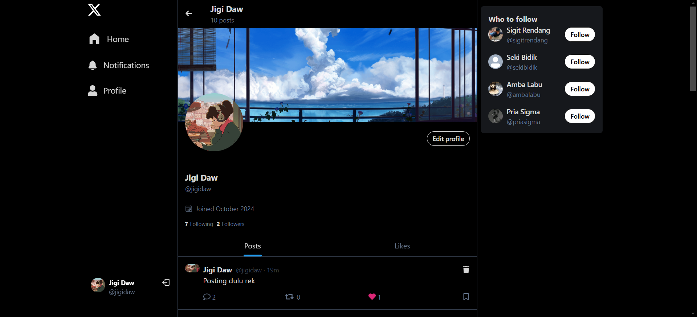

# Twitter Clone

A Full Stack Twitter Clone built with React.js and React Query on the Front-End and Express.js with PostgreSQL and Sequelize on the Back-End. This project simulates core Twitter features, allowing users to post tweets, like, follow, and engage in a real-time feed. The Back-End also includes an earlier version using MongoDB and Mongoose.

## Screenshots





## Features

- User Authentication (JWT-based)
- Tweet creation and engagement (like, comment)
- Follow/Unfollow functionality
- Real-time updates with React Query
- Responsive design with TailwindCSS and DaisyUI

## Tech Stack

**Front-End**
- React.js
- React Query
- React Router DOM
- TailwindCSS and DaisyUI for styling

**Back-End**
- Express.js
- PostgreSQL and Sequelize ORM (original MongoDB version available)
- JWT Authentication
- Cloudinary for media storage

## Getting Started

### Prerequisites

Make sure you have the following installed:
- Node.js
- PostgreSQL (for the main version) or MongoDB (for the alternative Back-End)

### Installation

1. Clone the repository:
   ```bash
   git clone https://github.com/yourusername/twitter-clone.git
   cd twitter-clone
   ```

2. Install dependencies for both the Front-End and Back-End.

   #### Front-End

   ```bash
   cd frontend
   npm install
   ```

   #### Back-End

   ```bash
   cd ../backend
   npm install
   ```

### Environment Variables

Create an `.env` file in the `backend` directory and configure the following environment variables:

```plaintext
# PostgreSQL Database Configuration
POSTGRES_URI=your_postgresql_database_url

# MongoDB Database Configuration
MONGO_URI=your_mongodb_database_url

# JWT Secret
JWT_SECRET=your_jwt_secret

# Cloudinary Configuration for media storage
CLOUDINARY_CLOUD_NAME=your_cloudinary_name
CLOUDINARY_API_KEY=your_cloudinary_api_key
CLOUDINARY_API_SECRET=your_cloudinary_api_secret

# Other
PORT=3000
NODE_ENV=development
```

### Running the Project

#### Back-End (Express Server)

From the `backend` directory, start the server:

```bash
# Development mode
npm run dev

# Production mode
npm start
```

NOTE: If you want to run it with the `MongoDB` version, you need to checkout to that version first before starting the server:

```bash
git checkout 455515c
```

The server will run on `http://localhost:3000`.

#### Front-End (React App)

From the `frontend` directory, start the app:

```bash
npm run dev
```

The Front-End will run on `http://localhost:5000`.

### Available Scripts

#### Front-End

- `npm run dev`: Start the Front-End in development mode
- `npm run build`: Build the Front-End for production
- `npm run preview`: Preview the production build locally
- `npm run lint`: Run linter checks

#### Back-End

- `npm run dev`: Start the Back-End server with `nodemon` for hot-reloading in development
- `npm start`: Start the Back-End server in production mode